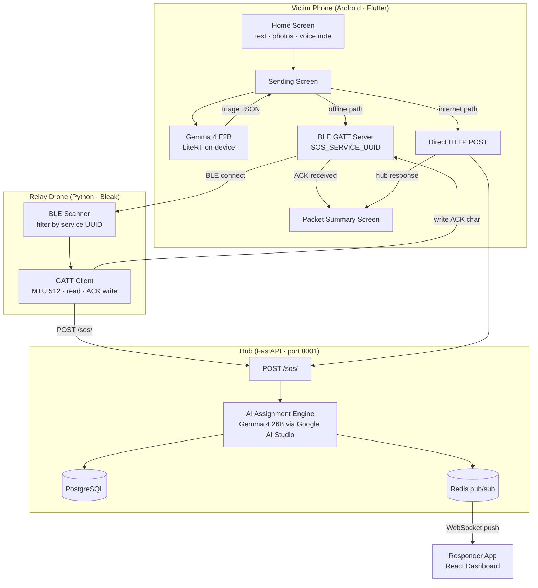
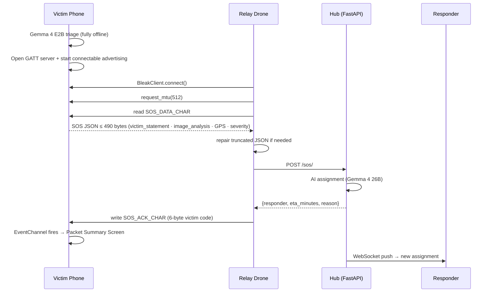
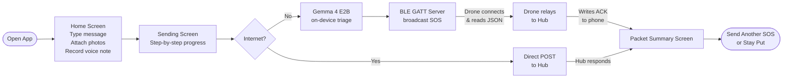
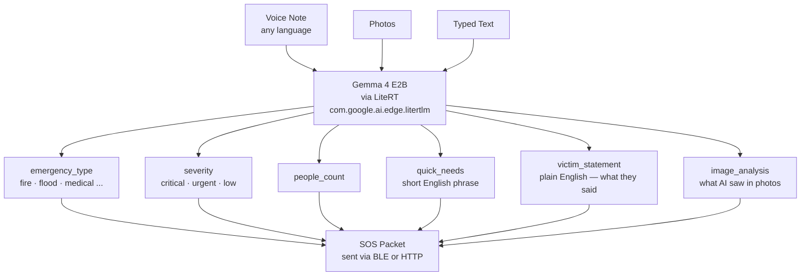

# ZeroHour

> **When the towers fall, ZeroHour still works.**

Offline-first disaster response powered by two tiers of Gemma 4 — **Gemma 4 E2B on-device** triages in any language with no internet, relayed over BLE GATT through drones to the hub where **Gemma 4 26B** assigns the nearest responder in real time.

A victim speaks Telugu. A drone overhead picks up the SOS over Bluetooth. A responder already on the ground — who may not speak Malayalam or Telugu — gets the full situation in English. All of it works when the towers are down.

Built for the **Gemma 4 Impact Challenge** · Global Resilience + LiteRT tracks · May 2026.

[](https://zerohour-frontend-416804666735.us-central1.run.app)
[](https://opensource.org/licenses/MIT)


---


## The Problem — Kerala 2018

In August 2018, Kerala experienced its worst floods in nearly a century. Over **5.4 million people** were displaced across all 14 districts. More than **483 lives** were lost. The Indian Army, Navy, Air Force, Coast Guard, and NDRF teams from across the country poured in — over 1,200 rescue boats deployed at peak, including more than 600 fishing boats mobilised by the local community.

And yet, coordination was chaos.

**The networks went down first.** Cell towers submerged one by one as water levels rose. Entire villages lost all communication. Families stranded on rooftops had no way to signal their location beyond waving sarees at passing helicopters. The state government resorted to civilian WhatsApp groups — screenshots of GPS coordinates shared by desperate victims going viral — as the de facto dispatch system. There was no triage. Every SOS was equal. Critical cases were missed because no one could tell them apart from non-critical ones \[1\].

**The language barrier made it worse.** Responders flew in from Tamil Nadu, Andhra Pradesh, Karnataka, Gujarat, and Maharashtra. Many spoke no Malayalam. Victims — elderly, panicked, speaking their village dialect — could not communicate their needs to the people trying to save them. Interpreters were improvised. Critical details were lost in translation \[2\].

**There was no intelligent routing.** A boat would travel to a location only to find the family had already moved, or that someone closer and more critical had been waiting longer. Responders duplicated effort. Commanders dispatched blind. The best tool available was a phone call to a WhatsApp group \[3\].

This is not a Kerala problem. It repeated in Uttarakhand 2013, Chennai 2015, Cyclone Fani 2019, and in every major disaster before and since. The infrastructure that emergency response depends on is exactly what disasters destroy.

ZeroHour was built so that the next time the towers fall, the response does not.

### What ZeroHour addresses

| Challenge seen in Kerala 2018 | ZeroHour's answer |
|---|---|
| Cell towers submerged, no connectivity | Gemma 4 E2B runs fully on-device — no internet needed |
| Victims stranded with no way to signal | BLE GATT relay — drone picks up SOS over Bluetooth |
| Responders from other states, no shared language | Gemma converts any spoken language to plain English automatically |
| No triage — all calls treated equally | On-device severity + emergency type classification in seconds |
| Coordination chaos, no intelligent routing | Gemma 4 26B at hub assigns nearest best-fit responder with ETA |
| GPS coordinates shared via screenshot | Structured SOS packet with precise lat/lng, type, severity, victim statement |

---

### References

\[1\] Scroll.in (2018). *As Kerala battles flood, social media helps connect anxious relatives, coordinate relief efforts.* [scroll.in](https://scroll.in/article/890699/as-kerala-battles-flood-social-media-helps-connect-anxious-relatives-coordinate-relief-efforts)

\[2\] SDMA Kerala / Institute of Sustainable Development and Governance. *Kerala Floods 2018 — Post-Disaster Report.* [sdma.kerala.gov.in](https://sdma.kerala.gov.in/wp-content/uploads/2020/08/Institute-of-Sustainable-Development-and-Governance-Report.pdf)

\[3\] Google AI Edge (2025). *LiteRT — on-device ML inference runtime.* [ai.google.dev/edge/litert](https://ai.google.dev/edge/litert)

---

---

## Why Gemma 4 — and Not Something Else

This is the question that matters. There are larger, more capable models out there. There are cloud APIs with better benchmark numbers. So why Gemma 4?

**Because in a disaster zone, the cloud is gone.**

GPT-4V and Claude all require an API call. In a collapsed building with no cell signal, they are as useful as a switched-off server. Llama 3.2 Vision has no native audio understanding and no production-grade Android runtime. Whisper + a separate vision LLM would require two models loaded simultaneously on a phone — more than 4 GB of RAM on a device already under stress.

**Gemma 4 E2B is the only open model that is:**

| Requirement | Why it matters | Gemma 4 E2B |
|---|---|---|
| Runs fully on-device | Disaster = no internet | ✅ 2B params, fits in phone RAM |
| Natively multimodal | Victims send voice + photos | ✅ Text + Vision + Audio in one model |
| Audio understanding | Most victims speak, not type | ✅ `Content.AudioFile()` via LiteRT-LM |
| Open weights | No API key, no privacy risk, works forever | ✅ Apache 2.0 |
| Android-optimized runtime | Needs to run in seconds on a mid-range phone | ✅ LiteRT (`com.google.ai.edge.litertlm`) |
| Structured output | Triage needs `severity`, `emergency_type`, not prose | ✅ Native function calling / JSON mode |

No other model hits all six. Gemma 4 E2B via LiteRT is the only combination that makes an offline-first multimodal triage system on a commodity Android phone possible today.

**On inference speed**: LiteRT is Google's optimized edge inference runtime — 2–3× faster than loading a GGUF through a generic runtime on the same hardware. On a Samsung A16, a full multimodal triage call (text + voice note + 2 photos) completes in under 10 seconds. That matters when someone is trapped.

**On the 2B parameter scale**: Gemma 4 E2B is not a compromise — it is the right tool for the job. Triage is a structured classification and summarization task. It does not need 70B parameters. It needs fast, accurate, on-device inference with enough language understanding to handle Telugu audio, flood photos, and a typed note at the same time. E2B delivers that.

---

## What ZeroHour Builds On Top of Gemma 4

### 1. On-device multimodal triage

When a victim hits send, Gemma 4 E2B runs entirely on their phone. It receives:
- Their typed message (any language)
- Their voice note (spoken in their native language)
- Photos they captured

It outputs a structured triage packet in plain English — understood by any responder anywhere:

```
emergency_type  : fire
severity        : critical
people_count    : 2
quick_needs     : immediate evacuation
victim_statement: I am trapped in a burning building with one other person
image_analysis  : Flames and thick smoke visible near a ground floor entrance
```

The `victim_statement` field is the key innovation. Rather than attempting word-for-word translation of romanized audio (which small on-device models do poorly), Gemma is prompted to summarize what the victim communicated in plain English. It understands the meaning from audio context — the panic, the words, the background sounds — and renders it comprehensibly. The responder knows exactly what the victim said without needing a translator.

### 2. BLE GATT relay pipeline — the phone as a server

When there is no internet, the phone does not give up. It becomes a **Bluetooth GATT server**, advertising the SOS payload to any nearby relay device. A drone flying a search grid overhead connects as a GATT client, negotiates MTU 512, reads the full JSON triage packet, POSTs it to the hub over its own uplink, and writes a 6-byte ACK back to the phone's writable characteristic. The victim's screen updates: *relay acknowledged*.

This is novel. Prior disaster-response BLE systems use non-connectable advertising beacons with tiny fixed-size payloads. ZeroHour uses the full GATT client-server model to transmit a rich, Gemma-generated JSON packet of up to 490 bytes — containing triage results, victim statement, image analysis, and GPS — over a single Bluetooth connection. No pairing. No app on the drone. Just a Python script and a BLE adapter.

### 3. Language-agnostic by design

A victim in rural Andhra Pradesh who speaks only Telugu can record a voice note. Gemma hears them, understands the situation, and generates English output for responders. The system never asks what language the victim speaks. It does not matter. Gemma 4's multilingual audio understanding handles it.

This directly addresses the **Digital Equity & Inclusivity** dimension of the challenge: ZeroHour works for the Tamil fisherman, the Hindi farmer, the Bengali factory worker — not just the English speaker with a stable internet connection.

---

## Architecture & Flow

### System overview



---

### BLE GATT relay — step by step



---

### App screen flow



---

### On-device AI pipeline (Gemma 4 E2B)



---

## Technical Stack

| Layer | Technology |
|-------|-----------|
| On-device AI | Gemma 4 E2B via `com.google.ai.edge.litertlm:0.11.0` (LiteRT) |
| Victim app | Flutter + Kotlin MethodChannel / EventChannel |
| BLE | Android BluetoothGattServer + Bleak (Python drone) |
| Hub API | FastAPI + uvicorn (async, port 8001) |
| Database | PostgreSQL 16 (SQLAlchemy 2 async) |
| Real-time | Redis 7 (pub/sub + live location TTL cache) |
| Hub AI | Gemma 4 26B (`gemma-4-26b-a4b-it`) via Google AI Studio |
| Dashboard | React 18 + Vite + Tailwind CSS |
| Infra | GCP Cloud Run + Cloud SQL + Cloud Memorystore |

---

## Live Deployment (GCP)

ZeroHour is fully deployed on Google Cloud Platform using a containerized architecture on **Cloud Run**.

*   **Frontend Dashboard**: [https://zerohour-frontend-416804666735.us-central1.run.app](https://zerohour-frontend-416804666735.us-central1.run.app)

### Deployment Architecture
The system uses **Docker** for all components, orchestrated in the cloud:
1.  **FastAPI Backend**: Runs on Cloud Run, scaling from 0 to 3 instances.
2.  **React Frontend**: Served via Nginx on Cloud Run.
3.  **Database**: PostgreSQL on Cloud SQL.
4.  **Cache/PubSub**: Redis on Cloud Memorystore.
5.  **AI Triage**: Gemma 4 26B hosted via Google AI Studio.

## Project Structure

```
ZeroHour/
├── victim_app/                     # Flutter Android app
│   ├── lib/
│   │   ├── main.dart               # Startup router (resumes pending SOS on restart)
│   │   ├── config.dart             # API URL, model path, SharedPreferences keys
│   │   ├── services/
│   │   │   ├── gemma_service.dart  # LiteRT MethodChannel — prompt + JSON extraction
│   │   │   ├── api_service.dart    # Hub HTTP client
│   │   │   └── ble_sos_service.dart# GATT server lifecycle + ACK EventChannel
│   │   └── screens/
│   │       ├── home_screen.dart    # SOS form — text input, camera, voice recorder
│   │       ├── sending_screen.dart # Step flow: triage → post / BLE relay
│   │       └── packet_summary_screen.dart  # Receipt: what Gemma understood + sent
│   └── android/app/src/main/kotlin/…/MainActivity.kt
│       # Gemma 4 E2B Engine init, multimodal triage, GATT server, ACK scan
│
├── drone/
│   ├── ble_relay.py                # BLE scanner → GATT client → hub POST → ACK write
│   └── requirements.txt           # bleak, httpx, winsdk
│
├── backend/
│   ├── main.py                     # FastAPI app (port 8001)
│   ├── schemas.py                  # SOSCreate (extra=ignore), SOSOut, AssignmentBrief
│   ├── db/
│   │   ├── database.py             # Async engine + aiosqlite / asyncpg
│   │   └── models.py               # SOSPacket · Responder · Assignment
│   ├── services/
│   │   ├── gemma.py                # Hub triage — Gemma 4 26B via Google AI Studio
│   │   ├── geo.py                  # Haversine + ETA
│   │   └── pubsub.py               # Redis channels
│   └── routers/
│       ├── sos.py                  # POST /sos/ · GET /sos/queue
│       ├── responders.py           # Register · heartbeat · live GPS
│       └── ws.py                   # /ws/supervisor · /ws/responder/{code}
│
└── frontend/                       # React responder + supervisor dashboard
    └── src/apps/
        ├── responder/              # Triage queue, packet detail, map, mesh radar
        └── supervisor/
```

---

## Getting Started

### Prerequisites

- Android device with BLE (tested: Samsung A16 5G, Android 10+)
- Python 3.11+ with BLE support (drone relay)
- Docker Desktop (Postgres + Redis)
- Node.js 20+ (dashboard)
- Flutter 3 SDK (only needed if building the app yourself)

### 1. Backend

```bash
cd backend
python -m venv godseye && godseye\Scripts\activate   # Windows
pip install -r requirements.txt
docker compose up -d
uvicorn main:app --reload --port 8001 --host 0.0.0.0
```

### 2. Drone relay

```bash
cd drone
pip install -r requirements.txt
python ble_relay.py --hub http://localhost:8001
# --verbose to log all BLE advertisements
```

### 3. Victim app (Android)

**Option A — Install the pre-built APK (recommended)**

Download the latest APK from [GitHub Releases](../../releases/latest) and sideload it onto your Android device.

**Option B — Build from source**

```bash
cd victim_app
flutter build apk --release
# Output: build/app/outputs/flutter-apk/app-release.apk
adb install build/app/outputs/flutter-apk/app-release.apk
```

**Load the Gemma 4 E2B model weights onto the device**

The app requires the Gemma 4 E2B `.litertlm` weights file. Download it from [HuggingFace / Google AI](https://ai.google.dev/gemma) and push it to the device:

```bash
adb push gemma.litertlm /sdcard/Android/data/com.zerohour.zerohour_victim/files/gemma.litertlm
```

> The weights file is ~1.5 GB and is not included in this repo.

### 4. Responder dashboard

```bash
cd frontend
npm install && npm run dev
```

Or use the live deployment: [zerohour-frontend-416804666735.us-central1.run.app](https://zerohour-frontend-416804666735.us-central1.run.app)

---

## API Reference

| Method | Endpoint | Description |
|--------|----------|-------------|
| `POST` | `/sos/` | Submit SOS — triggers AI triage + assignment |
| `GET` | `/sos/queue` | List SOS packets (`?status=pending`) |
| `PATCH` | `/sos/{id}/resolve` | Resolve an SOS |
| `POST` | `/responders/` | Register a responder |
| `POST` | `/responders/{code}/location` | Heartbeat — GPS + battery + vitals |
| `GET` | `/responders/live/locations` | All responders active in last 30 s |
| `PATCH` | `/responders/{code}/status` | available / en_route / busy |
| `WS` | `/ws/supervisor` | Real-time all-events feed |
| `WS` | `/ws/responder/{code}` | Real-time assignments for one responder |

### Full SOS payload (GATT relay example)

```json
{
  "victim_code": "V-BIGZ",
  "lat": 17.38530,
  "lng": 78.48667,
  "severity": "critical",
  "emergency_type": "fire",
  "message": "Victim is trapped in a fire and needs immediate rescue",
  "has_audio": true,
  "has_image": true,
  "hops": 1,
  "device_triage": {
    "emergency_type": "fire",
    "severity": "critical",
    "people_count": 2,
    "quick_needs": "immediate evacuation",
    "message": "Victim is trapped in a fire and needs immediate rescue",
    "victim_statement": "I am stuck in a burning building with one other person",
    "image_analysis": "Flames and thick smoke visible near a ground floor entrance"
  }
}
```

> Unknown fields are silently ignored (`model_config = {"extra": "ignore"}` on `SOSCreate`) so extended GATT packets never 422.

---

## AI Assignment Pipeline

1. SOS saved to Postgres → broadcast to supervisor via WebSocket
2. All `available` responders queried; Haversine distance computed, filtered ≤ 5 km
3. Top 5 candidates + triage context sent to Gemma 4 26B at hub
4. Model returns `{ assign, reason, eta_minutes, confidence }`
5. Assignment persisted; responder marked `en_route`
6. Redis pub/sub pushes to responder WebSocket in real time

Falls back to nearest role-matched responder if hub AI is unavailable.

---

## Environment Variables

| Variable | Default | Description |
|----------|---------|-------------|
| `DATABASE_URL` | `postgresql+asyncpg://...` | Postgres (Cloud SQL) |
| `REDIS_URL` | `redis://...` | Redis (Cloud Memorystore) |
| `OLLAMA_URL` | N/A | (Using Gemini API instead of Ollama in production) |
| `OLLAMA_MODEL` | N/A | - |
| `GEMINI_API_KEY` | required | Google AI Studio API key for Gemma 4 26B hub triage |

---

## Hackathon Context

- **Competition**: Gemma 4 Impact Challenge (Kaggle)
- **Tracks entered**: Global Resilience ($10,000) · LiteRT Special Technology ($10,000)
- **Deadline**: May 18 2026
- **On-device model**: Gemma 4 E2B (`gemma.litertlm`) via `com.google.ai.edge.litertlm:0.11.0`
- **Runtime**: Google AI Edge LiteRT — CPU backend, multimodal (vision + audio + text)
- **Hub model**: Gemma 4 26B (`gemma-4-26b-a4b-it`) via Google AI Studio
